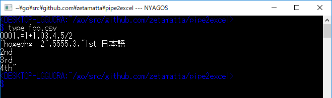
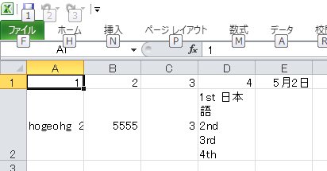
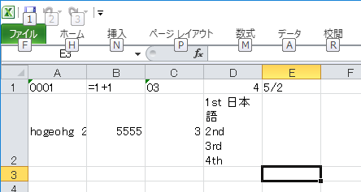

CSV を普通に Excel で開くと下記のような問題が発生する。

* 5/2 が「5/2」でなく、日付と解釈されて「5月2日」になってしまう
* =1+2 が「=1+2」ではなく、計算されて「3」になってしまう
    * 関数まで実行されてしまうので、脆弱性となってしまう





これを解決するには勝手に変な解釈がされないように、あくまで「文字列」としてセルに貼るプログラムを作ればよろしい。

仕様のイメージとしては「変換プログラムを「送るメニュー」とか、拡張子 CSV に割り当てると、CSVファイルをクリックした時、自動で Excel シートに安全に変換される」というのが望ましい。

拡張子に割り当てる、送るメニューに登録するとなると、スクリプト言語よりは、EXEファイルの方がよい。となると Go言語が適している。

Go言語で開発するとなると、２つのアプローチがある

1. .xlsx ファイルを [xlsx](https://github.com/tealeg/xlsx)、[excl](https://github.com/loadoff/excl)といったライブラリで静的に生成する
2. [go-ole](https://github.com/go-ole/go-ole) を使って、Excel を COM で呼び出して、Excel 経由でシートを作成する

「1.」は速度的に有利だが、テンポラリな .xlsx ファイルを作成してしまう。いきなり独立した .xlsx ファイルではなく、一度内容をチェックしてから、問題ないことを確認してから、ちゃんとした名前で保存する形の方が個人的には望ましく思えた。

ということで「2.」のアプローチを採用した。
（2019.02.24 追記：-o オプションで「1.」のアプローチ、つまり、いきなり独立した .xlsx ファイルを Excel なしに生成が出来るようにした）

で、完成品がこちらに。

* [zetamatta/pipe2excel: Make Pipeline To Excel and send each CSV To Excel cell as a string](https://github.com/zetamatta/pipe2excel)

変換した後、起動した Excel は敢えてそのままに。加工なり、セーブなりはユーザが自分でしてくださいということで（その方が「自分は」使いやすいと思った。もちろん .SaveAs や .Quit も出来るが、余計なお世話感強い）



* CSV は普通に標準ライブラリ `"encoding/csv"` で読み込む
   * ただし、そのまま読み込むと、１行あたりの項目数が変化した時に、csv.ErrFieldCount エラーになるので、<del>それだけは無視するようにする。</del> `("encoding/csv".Reader).FieldsPerRecord` に -1 をセットして、項目数チェックを無効にした（0.4～）
* CSV が `"unicode/utf8"`.Valid で UTF8 であれば UTF8 で、さもなければ現在のコードページ(日本語環境なら cp932=ShiftJIS)と解釈する
* セルにテキストを貼り付ける時、いきなりセルの `.Value` プロパティーに代入するのではなく、直前に `.NumberFormatLocal`プロパティーに `"@"` を設定して、セルの型を文字列にする。
   * ただし、あきらかに数値として解釈してさしえなさそうなテキストが文字列として設定してあると、Excelの警告マークがうるさいし、Excel自体で数値として扱いたい時に困るので、正規表現 `/^[1-9]\d*(\.\d*[1-9])?$/`と一致する場合は数値扱いとする（`.NumberFormatLocal`プロパティーに `"0_"`を設定する)
* 標準入力経由でも入力できるようにした

```
C:\> type foo.csv | pipe2excel
```

* CSVファイル名は複数指定できて、その場合は１ファイル名→１ワークシートとするようにした（ワークシート名はファイル名由来とした）

```
C:\> pipe2excel foo.csv bar.csv
```

いやー、しかし、Windows の分散オブジェクト(COM)の仕組み、それを操作する [go-ole](https://github.com/go-ole/go-ole) ライブラリ、Go言語の標準ライブラリ群の充実度はすばらしいぞ、デミウルゴス

以上

