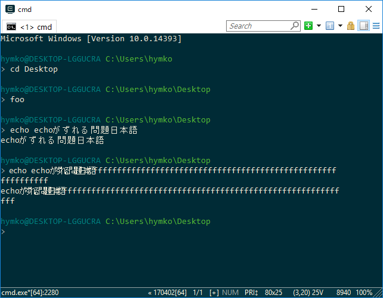

どうやら、画面幅を超えるテキストをCRLF無しで連続して出力すると、折り返し処理が走るタイミングでフォント幅の見積もり計算がおかしくなるようです。

```foo.cmd
echo echoがずれる問題日本語
echo echoがずれる問題日本語fffffffffffffffffffffffffffffffffffffffffffffffffffffffffffff
```




＞ **今、先方のサイトに issue 起案したから、ちょっと待ってて！** ＜

https://github.com/Maximus5/ConEmu/issues/1103

