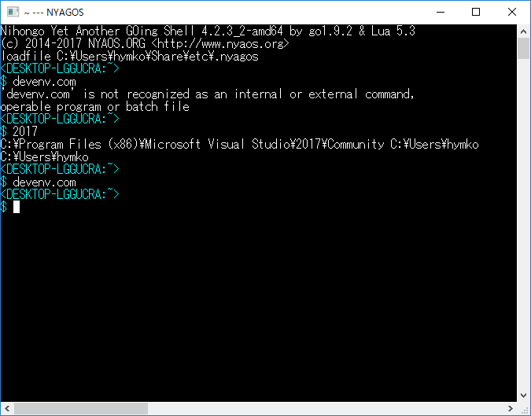

※2018.03.26記 4.2.5β で本件は過去の話になる予定です。詳しくは「[NYAGOS 4.2.5βが、いかにしてバッチファイルでの環境変数の変更取り込みを可能としたか](https://qiita.com/zetamatta/items/efff93d92ac2150192fb)」参照のこと
※2018.01.29記 sourceコマンドの不具合について追記あり（文末参照）

なぜバッチの環境設定が反映されないのか
===================================

CMD.EXE でバッチファイルを実行すると、バッチファイルの中での環境変数の変更が CMD.EXE にも反映されますが、NYAGOS では反映されません。

これは、NYAGOS の場合、**子プロセスとして呼び出した CMD.EXE でバッチファイルの読み込み・実行を行っているからです。一般に子プロセスから親プロセスに環境変数を反映するすべはありません**。

source コマンド
==============

これでは困るということで、**NYAGOS には source コマンドという内蔵コマンドがあります**。これを使えばバッチファイルでの環境変数やカレントディレクトリの変更を NYAGOS 側に取り込むことができます。

この source コマンド、いったいどうやって子プロセスの情報を取り込んでいるのでしょうか。その理由を知るには仕組みを理解する必要があります。コマンドラインで `source foo.cmd` と実行した場合、以下のような処理が行われます。

（１）以下のようなバッチファイルを `%TEMP%\nyagos-(プロセスID).cmd` という名前で作成

```batch:%TEMP%\nyagos-(プロセスID).cmd
@call foo.cmd
@set "ERRORLEVEL_=%ERRORLEVEL%"
@set > "C:\Users\（ユーザ名）\AppData\Local\Temp\nyagos-(プロセスID).tmp"
@cd > "C:\Users\（ユーザ名）\AppData\Local\Temp\nyagos_(プロセスID).tmp"
@exit /b "%ERRORLEVEL_%"
```

（２）このバッチファイルを CMD.EXE で実行する
（３）「`%TEMP%\nyagos-(プロセスID).tmp`」の内容を読み取って、NYAGOS.EXEプロセス本体の環境変数へ反映する
（４）「`%TEMP%\nyagos_(プロセスID).tmp`」の内容を読み取って、NYAGOS.EXEプロセス本体のカレントディレクトリへ反映する
（５）「`%TEMP%\nyagos-(プロセスID).tmp`」「`%TEMP%\nyagos_(プロセスID).tmp`」「`%TEMP%\nyagos-(プロセスID).cmd`」を削除する

これで理論上はバッチファイル上の環境変数やカレントディレクトリの変更を NYAGOS.EXE 側へ取り込むことができるはずです。

例：Visual Studio 2017 Community Edition
========================================

.nyagos に以下のような１文を足して、「`2017`」とタイプすると、Visual Studio 2017 の環境設定を行うようにします。

```lua:.nyagos
nyagos.alias["2017"]=[[pushd "C:\Program Files (x86)\Microsoft Visual Studio\2017\Community\." ; source "C:\Program Files (x86)\Microsoft Visual Studio\2017\Community\Common7\Tools\VsDevCmd.bat" $* ; popd]]
```

- `.nyagos` でいきなり source を実行してもよいのですが、nyagos の起動がいつも遅くなるのも嫌なので、ロードするコマンドを別途作成しました。
- `nyagos.alias["2017"]=` などとしているのは 2017 が数字で、Lua の識別子として使えないからです。`vs2017` などであれば、`nyagos.alias.vs2017=`と書けます。



期待どおり動作しているようです。

だがしかし
=========

どうも自分の預かり知らぬところで、この仕組みがうまく動かないという噂を聞いています。

もし、そのような場合は「**`source -d バッチファイル名`**」とデバッグオプション（`-d`）付きで実行してみてください。そうすると上の（５）のテンポラリファイルの削除が行われなくなります。テンポラリファイルの結果からうまくゆかない原因が分かるかもしれません。

それをもって[issue を起案](https://github.com/zetamatta/nyagos/issues)していただければ、こちらも何らかの対応ができると思います。

余談
====
* `source` には `-d` オプションの他、`-v` オプションというものがあります。`-v` をつけると、テンポラリファイルの結果を画面にも出力します。
* `source` コマンドの前身は NYAOS-3000 の `cmdsource` という Lua で実装したコマンドです。NYAGOS では、これをネイティブな Go 言語で実装しています。
* `source` コマンドの別名として「`.`」（ピリオド一つ）も使えます。

2018.01.29追記：source コマンドの不具合
===================================
NYAGOS 4.2.3_2 までのsource コマンドでは、実行したバッチファイルの標準出力・標準エラー出力が画面に出ないという不具合がありました。

環境変数を読み取るという目的の機能には不備はありませんが、この不具合によって、環境変数バッチがちゃんと呼び出されているか分からないという問題がありました。

当不具合は [NYAGOS 4.2.3_3](https://github.com/zetamatta/nyagos/releases/tag/4.2.3_3)にて修正されました。

ぶっちゃけると
-------------
実は画面に何もでないのは**「そのバッチが元から何も出力しないバッチ」**だと思い込んでいて、**全く疑いもしなかった**んですね。こういう開発者の思い込みがあるから、ささいなことでも不具合報告いただけると、すごく助かるわけなんです。

今回は[tyochiaiさん](https://github.com/tyochiai)から報告だけでなく、[不具合を修正するプルリクエスト](https://github.com/zetamatta/nyagos/pull/276)をいただきました。ありがとうございました。

以上

