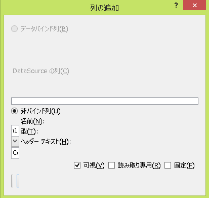
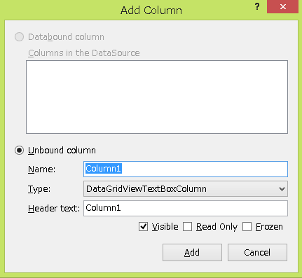

**バグってる！**

ぐぐった
========

* [DataGridViewタスクの「列の追加」の画面崩れ](https://social.msdn.microsoft.com/Forums/security/ja-JP/16f031c8-749e-4bcb-8abd-6b6a64146555/datagridview?forum=csharpgeneralja)

MSDN の記事はすぐ行方不明になるので、要点を整理すると

* 日本語の言語パックが壊れているらしい
* 英語の言語パックを導入してから、英語の状態で列を追加すればよい

最新のサービスパックで直っているかもしれないけど、念のため

手順
====

1. 英語の言語パックのダウンロード
   * VisualStudioのメニューの「ツール」→「オプション」→「環境」→「国際対応の設定」→「追加の言語を取得する」で、ブラウザでダウンロード画面が出る。
   * ダウンロードした vs_langpack.exe を実行する
2. 英語環境にする
   * 「ツール」→「オプション」→「環境」→「国際対応の設定」→「English」
   * VisualStudio を再起動

バッチリだぜ！

