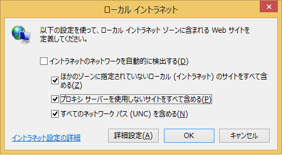

# 普通は「共有フォルダー」をネットワークドライブに割り当てる

**だが、この方法だと、そこのEXEファイルを実行する度に、警告ダイアログが出てしまう**

これを出ないようにするには、「インターネットオプション」→「セキュリティー」タブ→「ロ－カルインターネット」を選択→「サイト」で、以下のようにホストOSがイントラネットに含まれるように設定してやる必要があった。



だが、この方法を使っても、**実行ファイルをゲストOSのタスクバーにピン留めができない**という問題があった。仕方がないので、ずっと、デスクトップにアイコンを作って我慢してきたのであるが…

だが、私は気付いてしまった…

#「共有フォルダー」へのシンボリックリンク(not ジャンクション)を、ゲストのC:ドライブの中に張れば、ピン留めできる！

シンボリックリンクを張るには、管理者権限のコマンドプロンプトより、mklink /D コマンドを使えばよい。

以下は、ホストOSの Opt というディレクトリにあるサブディレクトリ、ファイルをゲストOSの %USERPROFILE% 以下に自動でリンクするバッチファイルだ。これの実行には [sudo for UAC](https://bitbucket.org/wantora/sudo)が必要だ（が、別に手作業でやる分には無くても問題ない。CMD.EXE を管理者で実行すればよいだけ）。参考までに…

```bat:SetVmHome.cmd
if "%1" == "-" goto main
    sudo %COMSPEC% /c "%~0" -
    goto end
:main
    for %%I in (bin bin64 vimfiles App Repos gosrc) do (
        rd "%USERPROFILE%\%%I" 2>nul
        mklink /D "%USERPROFILE%\%%I" "\\vmware-host\Shared Folders\Opt\%%I"
    )
    for %%I in (.nyagos .vimrc .gvimrc ) do (
        del "%USERPROFILE%\%%I" 2>nul
        mklink "%USERPROFILE%\%%I" "\\vmware-host\Shared Folders\Opt\%%I"
    )
:end
```

