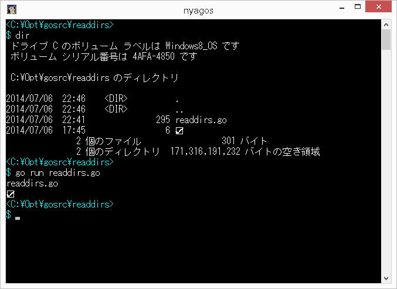

何も考えずに書いてみる

```readdirs.go
package main

import "fmt"
import "os"

func main(){
	fd , err := os.Open(".")
	if err != nil {
		fmt.Fprintln(os.Stderr,err)
		return
	}
	nodes , err := fd.Readdir(-1)
	if err != nil {
		fmt.Fprintln(os.Stderr,err)
		return
	}
	fd.Close()
	for _,n := range nodes {
		fmt.Println(n.Name())
	}
}
```

えーと、「☑」は SJIS にはなかったよね？



goだと、特に迷うことはない。Python も同様に早く Windows の Unicode API に対応してほしいです。(それとも、Python 3 とかだと対応してるのかな？)

