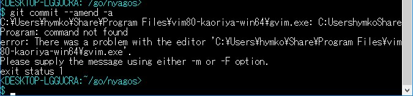

お願い
=====

* 問題が確認されたら、気兼ねなく [issue](https://github.com/zetamatta/nyagos/issues) を立ててください。
     * 日本語で書いてもらっても、まったく問題ありません
     * 間違い、勘違いの類があっても構いません。問題解決を支援します。
     * 詳しい症状の報告もなく、SNSでだけ「単にダメ」と言われるのが一番つらいです。
* できれば、CMD.EXEで実行した時にどうなるかを確認して、問題の所在を確認してください。
     * ConEmu、msysGit 側の問題を、NYAGOS に起因する問題と誤解されることが多く、困っています。

実績を積んでいきたいのですが、その前に「使いものにならない」という評判が定着してしまうのを懸念しています（実際、使いものにならないのかもしれませんが）

個別事例（随時追記します）
======================

環境設定コマンドが効かない (2018.01.18)
------------------------

**(2018.04.09追記)** NYAGOS 4.2.5 よりバッチファイルでの環境変数の変更が自動で取り込めるようになりました。→ 参考：[NYAGOS 4.2.5βが、いかにしてバッチファイルでの環境変数の変更取り込みを可能としたか](https://qiita.com/zetamatta/items/efff93d92ac2150192fb)

<DEL>環境変数を設定するバッチファイルが実行されていると思われますが、CMD.EXE と違い、バッチファイルの実行は子プロセスで行われているため、そのまま実行しても NYAGOS 本体へ反映させることができません。</DEL>

<DEL>そのため `source` コマンドを用います。詳しくは「[NYAGOS で環境設定系バッチファイルが期待どおり動かない原因と対策](https://qiita.com/zetamatta/items/f62bafd711755a4cf8d7)」をご覧ください</DEL>

画面の桁数が多く設定すると、画面が乱れる (2018.01.18)
-------------------------------------
これは NYAGOS で用いているライブラリの不具合が原因でした。

* [Garbage appears on the screen · Issue #264 · zetamatta/nyagos](https://github.com/zetamatta/nyagos/issues/264)

300桁など、画面の桁数を多くすると、画面クリア時のセル数計算でオーバーフローして、画面全部をクリアしきれず、スクロールするとゴミが現れることがあります。

本不具合は NYAGOS 4.2.3_1 にて修正されています。

ConEmu + NYAGOSで画面が乱れる
---------------------------
* 「+ NYAGOS」と書いていますが、NYAGOSは関係なく、ConEmu + CMD.EXE でも発生します。
* 画面幅を超えるテキストをCRLF無しで連続して出力すると、折り返し処理が走るタイミングでフォント幅の見積もり計算がおかしくなる（[詳細](http://qiita.com/zetamatta/items/698efdabecae8bbbcbd9)）
    * ConEmu側の設定：`Setting` → `Main` → `Compress long string to fit space` を無効にすることで治ります
* 中国語、日本語などをタイプするとカーソル位置がおかしくなる
    * ConEmu側の対応待ちです（対応 issue は下記のとおり）
        * [wrong cursor position when typing chinese · Issue #1051 · Maximus5/ConEmu]( https://github.com/Maximus5/ConEmu/issues/1051)
        * [When I input Japanese characters, cursor was shown far away from the text I inputted. · Issue #1111 · Maximus5/ConEmu](https://github.com/Maximus5/ConEmu/issues/1111) （← #1051 と重複するためクローズ）

msysgit でエディターが起動しない
-----------------------------

* msysgitでcommitログを編集するエディタをフルパスで指定する時は「`GIT_EDITOR="C:/Program Files/vim80-kaoriya-win64/vim.exe"`」のように
    * 空白を含まれる場合は、環境変数GIT_EDITOR に「**二重引用符が含まれる形**」になるように指定してください。
    * パス区切り文字は`/`を使ってください

この仕様は git に含まれる msys-bash に起因するものです。

grep がない
----------

* NYAGOS は MSYS や Cygwin のような、総合 UNIX エミュレーション環境ではなく、同プログラムは同梱していません。
* Windows には findstr.exe という grep 的なプログラムがありますので、これを使っていただくのがよいと思われます。
    * 基本的に現在のコードページの言語、つまり、日本語系では Shift-JIS(CP932)テキストが前提になります
    * オプション指定文字が「-」（マイナス）ではなく「/」（スラッシュ）になっています。
* [jvgrep](https://github.com/mattn/jvgrep) という処理系もあります。こちらは UTF8対応、正規表現が Perl 準拠（単語の区切りは `\<`～`\>` ではなく、`\b` になっている）、カラー表示対応となっています。

NYAGOS 4.0.9 が落ちる
-----------------------

**4.0.9 は安定版でも何でもありません！**

4.0系列はマルチスレッドでの Lua インスタンスの取り扱いに問題があり、クラッシュが起こりやすくなっています。少なくとも、根本解決されている 4.1系列以降にアップデートいただかないと、サポートできません。

